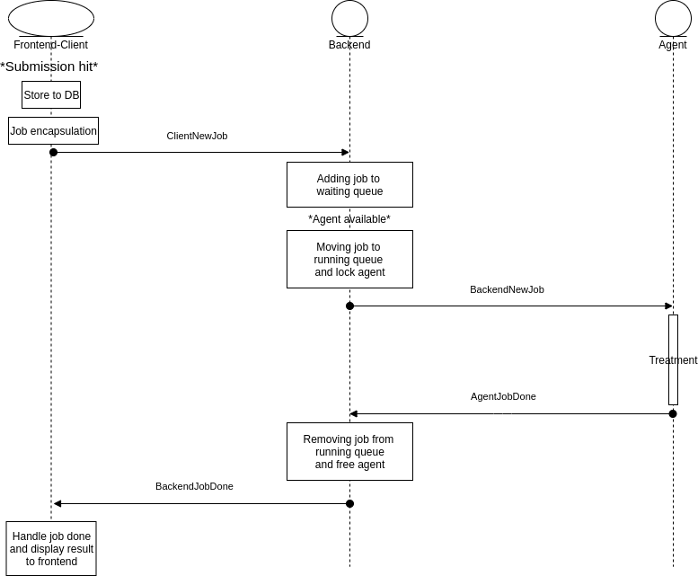

Submissions
===========

Workflow
--------

INGInious manage submission as a group of steps splitted between three major parts : FrontEnd/Client, Backend and Agent.

This workflow represents a basic INGInious installation with a basic frontend. For understanding purpose, we represent a workflow where everything is going well.

The process is initialized when the user hits the submission button. This stores initial information about submission in the database and encapsulates the submission within a job.
This first step is finalized with a *ClientNewJob* message sent to the backend with the job included.

The backend stores the job in a waiting queue. When an agent released and the job is the next one in the queue, The job is moved to the running queue, a *BackendNewJob* message is sent to the agent.

Agent treats then the job and once it's over, returns a *AgentJobDone* message to the backend. This one removes job from the running job queue and send a *BackendJobDone* to the client. The client end the process by displaying the result within the frontend and by updating information in the database.

State
-----

Submission is represented as a dictionary from the database. Easy to share and structured.
The concept of Submission have no specific object class in INGInious.
Submissions are structured as this :

  .. code-block:: JSON

    {
        "_id" : "The id of the submission"
        "courseid" : "The id of the course", 
        "taskid" : "The id of the task", 
        "status" : "The status of the submission. May takes differents value : Done,Waiting,Error", 
        "submitted_on" : "The date of the submission", 
        "username" : "A list containing the username of the user(s) who submitted.", 
        "response_type" : "The response format", 
        "input" : "Input file of the gridfs", 
        "archive" : "either None or a bytes containing a tgz archive of files from the job", 
        "custom" : "custom is a dict containing random things set in the container", 
        "grade" : "grade is a number between 0 and 100 indicating the grade of the user", 
        "problems" : "problems is a dict of tuple, in the form {'problemid': result}", 
        "result" : "The result of the submission. May takes differents value: Success,Failed,Crash", 
        "state" : "state is dynamic property that lets you store data related to the submission", 
        "stderr" : "The output of the stderr stream", 
        "stdout" : "The output of the stdout stream", 
        "text" : "The text feedback" 
    }
  

Submission come then with an interesting property : State.

State is a property that lets you store data related to the submission.
State can be viewed as a register. The output value of the evaluation submission is the input value of the next submission. 
State is only managed by the frontend since it is stored in database along with the evaluation submission for a given user/taskid. State may be then used with some Javascript.
You can set state with string data.

Evaluation
----------

Submission evaluation is possible in two different ways : By evaluating the best one or the last one.
As main part of the evaluation is done within the backend with only one submission, the selection part is done on frontend part.
If the user run a new submission and that it suits with the evaluation, the submission id is store in database in the user task collection.
The evaluation part really starts when the job is treated by the agent. The agent receives a *BackendNewJob* message and have to handle it. It starts its new_job function.

For MCQ agent, it starts by getting files from task and course file system and the translation files. 
Then it iterates over the problems and run, for eah problem, a check_answer method. This method may have different behaviour depending on the type of the problem.
Finally, it calculates the number of good answers to return the correct feedback.

For Docker agent, all the work is done within the Asyncio event loop. The event loop is the driver code that manages the cooperative multitasking.

.. image:: submission_evaluation_docker.png
    :align: center

A new synchronous job generate the needed element. It begins with the file system, copying files (especially task files and $common files) and creating the container. 
It continues by adding new info of the new container and then, of course, starts this one. This job runs within the default executor of the event loop.

Once this is done, a safe task (for the agent) is generated for handling the running container (with the data generated from the synchronous job).
The execution of a coroutine function (handle_running_container) is scheduled and a Task object will be returned. Third-party event loops can use their own subclass of Task for interoperability. In this case, the result type is a subclass of Task.
When run() ends, these tasks are automatically cancelled.

The handling of the container is manage through a socket. Messages with data are sent to the container with the run command to evaluate the code. 
Container will then respond with three possible message: student_container, ssh or result.
The first one starts a new student container.
The second one, returns the information for a ssh connection.
The last one, of course, return the results of the run command.
The first two message will generate new action ( create a safe task for the student_container or create a job for ssh info).
The last one will simply set the results and send them back to the frontend for the display part.