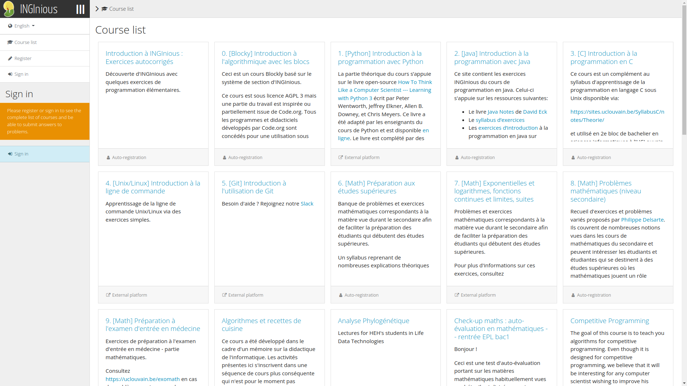

# Home

{.index-logo width=250px}

**INGInious** is an open-source intelligent grader that allows secured and automated testing of code made by students

[Get started](setup.md){ .md-button .md-button--primary .index-callout }
[Public Instance](https://inginious.org/?lang=en){ .md-button .md-button--secondary target=\_blank }

{.index-screenshot width=500px}

## Features

## Screenshots

## Contributing

### Features Requests

### Bugs

### Translation
